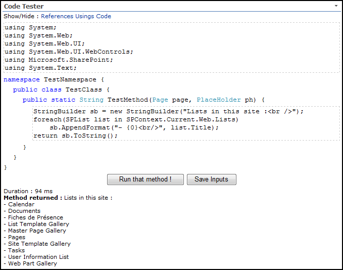
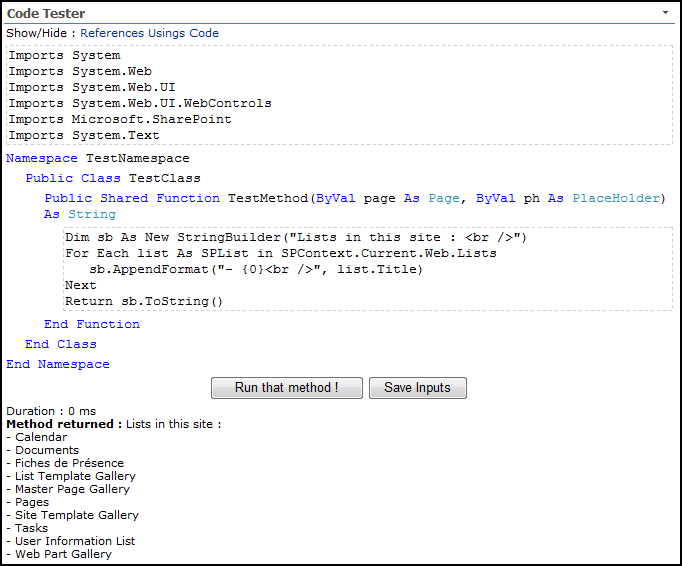
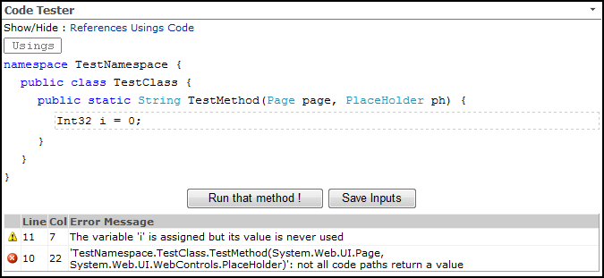
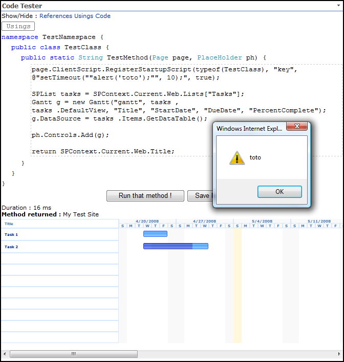

*This old project for SharePoint 2007 was initially hosted on Codeplex, and migrated on GitHub for the sake of history.*

This WebPart uses CodeDom and Reflection to dynamically compile an assembly and run a method containing user's input.

Test your .NET code in Sharepoint's web context without deploying anything and without waiting for Sharepoint to initialize.

Type some code directly in the textbox and click a button to run it !

Since v0.0.0.2 you can code in VB.NET too :

View compiler errors just like in Visual Studio :

Test controls and script injections :

Considerations

* This web part is a developer tool that IS a major security hole as any code can be run through it, by any user with access to the site it's deployed to. It's not meant to be deployed to any production environment.
* It is best viewed in Internet Explorer